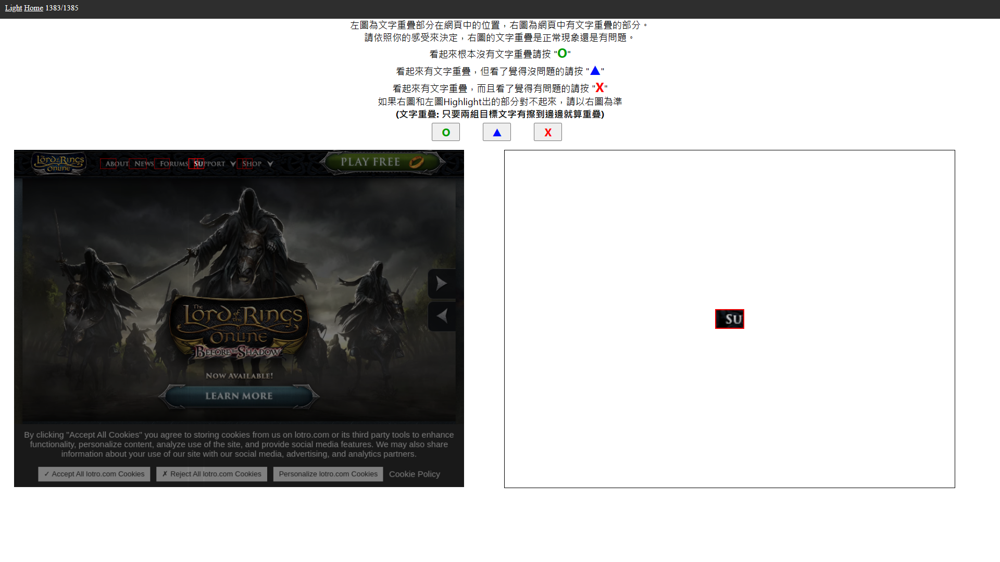

# Tagging App for Overlapping Detection

## Introduction
This is an app to tag testcases for Overlapping Detection

## Requirements
- **Node.js**
    - If you don't have **Node.js** in your device, click [HERE](https://nodejs.org/en/download/).

## Installation

1. **git clone / download** this repo from [Github](https://github.com/IchBinTiMo/Tagging-App-for-Overlapping-Detection)
2. Run `npm install` in terminal under the directory `
Tagging-App-for-Overlapping-Detection`

## Execution
1. Go to [DS(1)]() / [DS(2)]() to download your dataset, unzip it, and put `highlight/` and `specificArea/` into `Tagging-App-for-Overlapping-Detection/cases/`
2. Run `npm run start` in terminal under the directory `
Tagging-App-for-Overlapping-Detection` 
2. Go to [http://localhost:8080/](http://localhost:8080/)
3. Click button according to your feelings.
4. After tagging all cases, upload `Tagging-App-for-Overlapping-Detection/result.json` to [RS(1)]() / [RS(2)]() depends on which dataset you downloaded.
```diff
- Please DO NOT replace any other files while uploading.
```

## How To
- Click `Start`, and you should see 2 images and 3 buttons like below.
    
- 2 Images
    - The **right** one is the target image, which only show the overlapping area.
    - The **left** one is the reference image, which display where the target is in the whole viewport.
- 3 Buttons
    - `O` means there is **NO** text-overlapping in the target image
    - `▲` means that the text overlaps, but you **DON't** feel uncomfortable when you look at those overlapping text.
    - `X` means there is text-overlapping, and you **DO** feel uncomfortable when you look at overlapping text.

## What Is Text-Overlapping
- One text is covered by other text.
- 2 sets of text touch each other.
