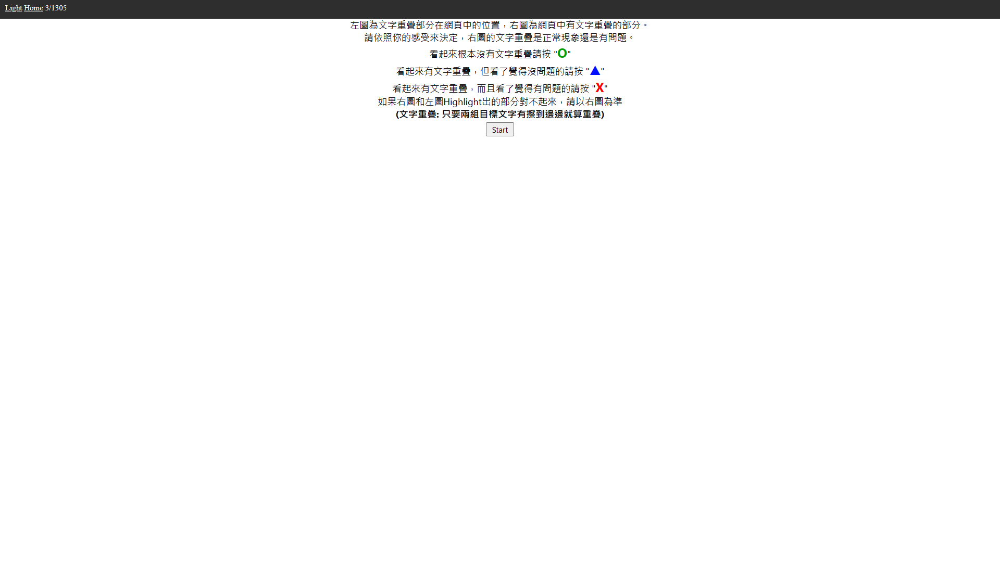
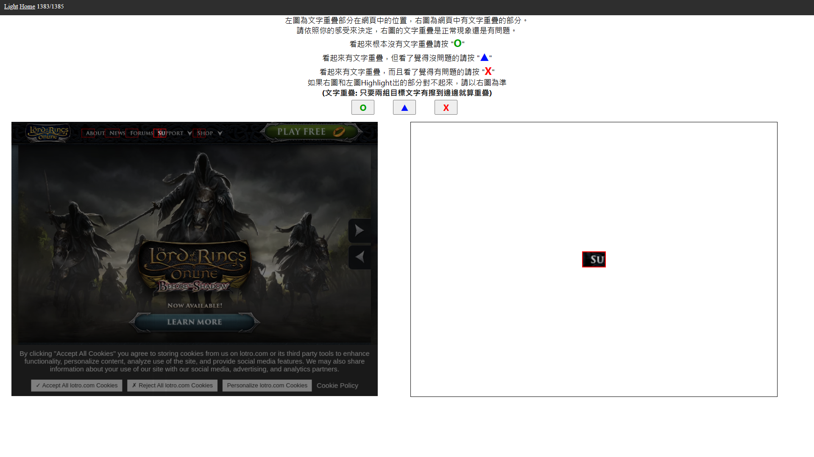

# Tagging App for Overlapping Detection
[](https://github.com/IchBinTiMo/Tagging-App-for-Overlapping-Detection/blob/main/README.md)
[](https://github.com/IchBinTiMo/Tagging-App-for-Overlapping-Detection/blob/main/README.zh-tw.md)

## 簡介
這是一個用來幫文字重疊偵測的測資按標籤的app。

## 需求
- **Node.js**
    - 如果電腦裡沒有 **Node.js**, 請到 [這裡](https://nodejs.org/en/download/)下載。

## 安裝

1. 從[Github](https://github.com/IchBinTiMo/Tagging-App-for-Overlapping-Detection)下載。
2. 從終端機到`Tagging-App-for-Overlapping-Detection/`底下執行`npm install`。

## 執行
1. 從[DS(1)](https://drive.google.com/file/d/1FtxAzK8ioxpodsNJ3xrZRGgmTDU8Lt17/view?usp=share_link) / [DS(2)](https://drive.google.com/file/d/1aCQqhVTvAB0zB4r3mxz7QmI6xGoxBeS7/view?usp=share_link)下載被指派的資料集，解壓縮之後會得到`highlight/`、`specificArea/`兩個資料夾，把他們放到`Tagging-App-for-Overlapping-Detection/cases/`。
2. 在`Tagging-App-for-Overlapping-Detection/`底下執行`npm run start`
3. 前往[http://localhost:8080/](http://localhost:8080/)。
3. 根據你的感覺按按鈕。
4. 全部按完之後，根據你下載的資料集，把`Tagging-App-for-Overlapping-Detection/result.json`上傳到[RS(1)](https://drive.google.com/drive/folders/16s_tiyYYnyGiu0BU-mG-JqUDtbpxeUP7?usp=share_link) / [RS(2)](https://drive.google.com/drive/folders/1So1hxqI13wWlB6Wl2PmYedsk8nZ6cVD8?usp=share_link)。

```diff
- 上傳的時候請不要動到任何其他的檔案
```

## 使用說明
- 起始頁面如下圖所示。
    
- 按下`Start`，然後你會看到2張圖片和3個按鈕，如下圖所示。
    
- 2張圖片
    - **右圖**只會顯示出一個有文字重疊的地方。
    - **左圖**會顯示出右圖在左圖中的位置。
    - 如果兩張圖對不起來，請以右圖為準。
- 3個按鈕
    - `O` 表示右圖中**沒有**文字重疊。
    - `▲` 表示右圖有文字重疊，但看了覺得**沒有**問題。
    - `X` 表示右圖有文字重疊，但看了覺得**有**問題。

## 怎樣算是文字重疊
- 一組文字被另一組文字蓋到。
- 兩組文字相互接觸，就算只有擦到邊邊也算。
